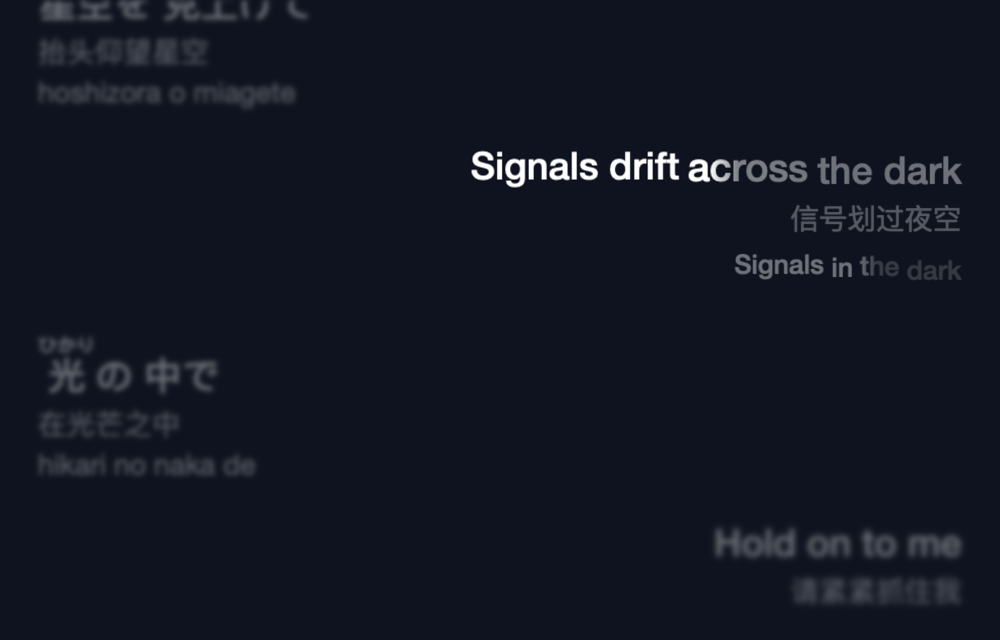
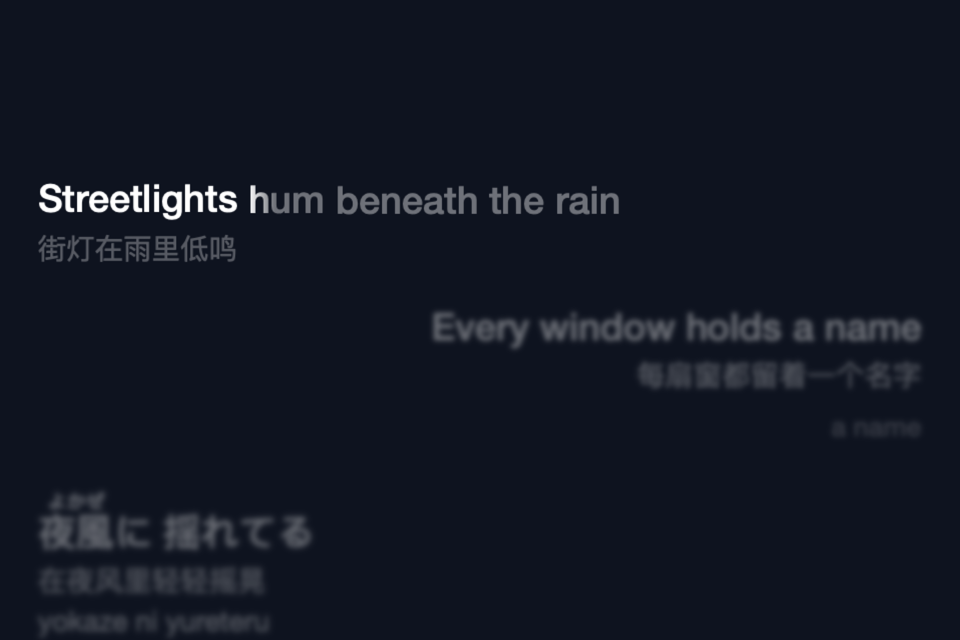
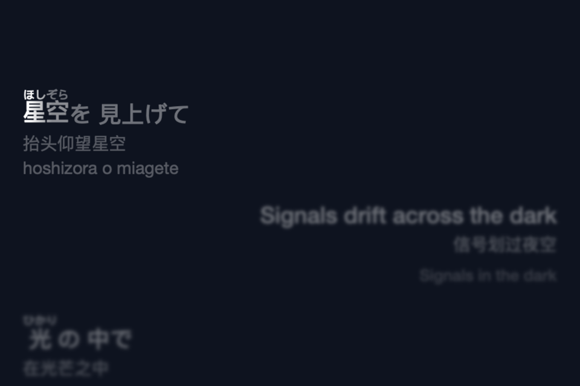
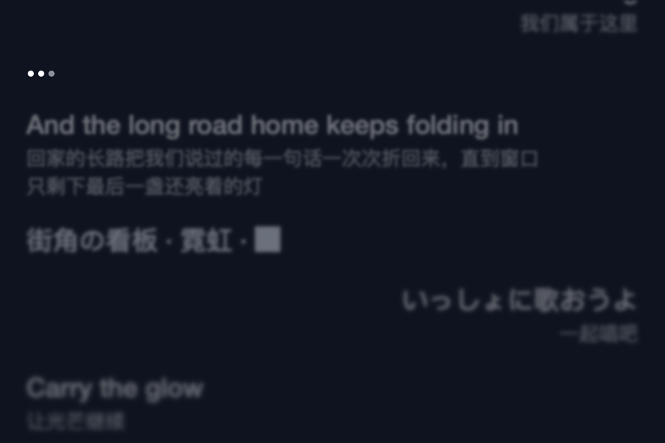
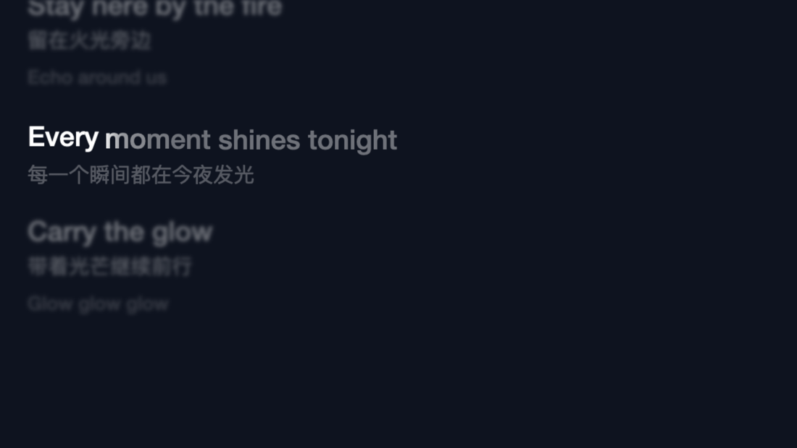

# MelismaKit



`MelismaKit` is a native macOS lyric renderer built with AppKit, Core Text,
Core Animation, and Core Image. It accepts AMLL-compatible TTML directly and
keeps media timing in seconds; the host supplies playback state and remains the
owner of the audio player.

The package is split into two products:

- `MelismaKit` contains the renderer, TTML decoder, timeline, layout, motion,
  interaction, and value models.
- `MelismaKitSwiftUI` contains one small `NSViewRepresentable` bridge. It
  mounts a host-owned `LyricsView` and does not mirror renderer state or create
  a second controller hierarchy.

Appearance and behavior belong to the component. `LyricsConfiguration` exposes
typography, palette, alignment, translation/Ruby/romanization, highlight and
obscenity modes, cover-blur channels, compositing, raster quality, display-link
cap, and motion controls. The host only supplies its semantic inputs and media
state; it does not patch layers or DOM details.

## Requirements

- macOS 15 or later
- Swift 6.1 toolchain or a newer compatible toolchain
- AppKit for the renderer; SwiftUI is optional through `MelismaKitSwiftUI`

## Swift Package Manager

Add the package dependency:

```swift
dependencies: [
    .package(url: "https://github.com/kmgcc/melismakit.git", from: "0.2.0")
]
```

Then link the products required by the target:

```swift
dependencies: [
    .product(name: "MelismaKit", package: "MelismaKit"),
    .product(name: "MelismaKitSwiftUI", package: "MelismaKit")
]
```

## Minimal AppKit integration

`LyricsView` is the component boundary. A host creates it on the main actor,
loads TTML bytes, sends playback samples, and handles lyric-click seeks:

```swift
import MelismaKit

@MainActor
final class LyricsController {
    let view = LyricsView(frame: .zero)

    init() {
        view.onSeek = { sourceTime in
            // Ask the host audio player to seek to sourceTime.
        }
    }

    func load(ttml: Data) throws {
        try view.load(ttml: ttml, time: 0, playing: false)
    }

    func update(time: Double, isPlaying: Bool) {
        view.synchronize(time: time, playing: isPlaying)
    }
}
```

Configure the component directly when the host needs a different presentation:

```swift
var configuration = LyricsConfiguration()
configuration.fontSize = 36
configuration.showTranslation = true
configuration.motion.pointerExitDelay = 0
configuration.palette.mainActive = LyricsColor(0.95, 0.98, 1.0)
lyricsController.view.configuration = configuration
```

For a background import path, decode away from the UI executor and install the
already parsed value on the main actor. `load(ttml:)` remains available and
unchanged for synchronous callers:

```swift
@MainActor
func loadInBackground(_ data: Data, into view: LyricsView) async throws {
    let document = try await TTMLDecoder().decodeAsync(data)
    view.install(document: document)
}
```

## SwiftUI integration

The SwiftUI product intentionally keeps ownership explicit:

```swift
import MelismaKit
import MelismaKitSwiftUI
import SwiftUI

struct LyricsPanel: View {
    let lyricsView: LyricsView

    var body: some View {
        MelismaKitViewRepresentable(view: lyricsView)
    }
}
```

Keep the `LyricsView` in the host's state/controller lifetime. SwiftUI may
recreate the representable value, but the AppKit view remains the single source
of truth for rendering and interaction.

## Rendering features

| | |
|---|---|
|  |  |
| Word-by-word karaoke highlight on the active row | Ruby (furigana) above the base text, with romanization and translation layers |
|  |  |
| Interlude dots while no line is being sung | Emphasis, glow, and blur driven by per-word timing |

Every image is a deterministic render produced by `MelismaKitProbe` from the
bundled fixtures, not a hand-taken screenshot. See
[Demo and probe](#demo-and-probe) to regenerate them.

## Demo and probe

Run the AppKit Demo from the repository root:

```sh
swift run --quiet MelismaKitDemo
swift run --quiet MelismaKitDemo --ttml /path/to/lyrics.ttml
```

The Demo includes bundled TTML fixtures for word timing, line timing, glow,
duet/Ruby, and background vocals. External files can be selected with the open
panel. To inspect a directory-based catalog, pass one or more explicit roots;
the Demo never reads an application-specific library registry:

```sh
swift run --quiet MelismaKitDemo --dump-catalog \
  --library-root /path/to/Library
```

The catalog accepts a root containing `Tracks/<track>/lyrics.ttml`, a `Tracks`
directory, or a single directory containing `lyrics.ttml`. Adjacent
`meta.json` and audio files are optional.

For deterministic rendering measurements:

```sh
swift run --quiet MelismaKitProbe \
  Sources/MelismaKitDemo/Resources/complex.ttml \
  /tmp/melismakit-probe 10 760 720 --paused
```

See [VALIDATION.md](VALIDATION.md) for the current test and manual-validation
record, and [BEHAVIOR-REGRESSIONS.md](BEHAVIOR-REGRESSIONS.md) for the renderer
contracts covered by regression tests.

For where the project is going — and the phased plan for getting there — see
[Documentation/ROADMAP.md](Documentation/ROADMAP.md).

## Architecture and compatibility

The core package has no dependency on a player application, track model,
settings store, theme store, WebView, audio engine, or application bundle
resources. It communicates with a host through value types, configuration, the
`onSeek` callback, and playback samples passed to `synchronize`.

`LyricsProfile.currentPlayer` is a compatibility preset for hosts that need the
existing native timing behavior; `LyricsProfile.upstream` is the explicit
upstream-style alternative. Both are implemented inside the component, so a
host does not need a compatibility orchestration layer.

More detail is in [Documentation/INTEGRATION.md](Documentation/INTEGRATION.md).

## Relationship to AMLL

[AMLL (Apple Music-like Lyrics)](https://github.com/steve-xmh/applemusic-like-lyrics)
is a web implementation: TypeScript, a DOM layer tree, and a browser rendering
path. MelismaKit is a native implementation for macOS built on AppKit, Core
Text, and Core Animation. **It is not an official Swift port of AMLL and is not
affiliated with or endorsed by the AMLL project.**

The two share a format, not a codebase. MelismaKit parses the same TTML profile,
so a file that renders in AMLL renders here. Its timing, layout, motion, and
interaction behavior were developed to match AMLL's observable behavior — and
for a number of functions, by reading AMLL's source rather than its
documentation. Those functions are derived works:

- [`NOTICE`](NOTICE) records the AMLL attribution, the derived modules, and the
  access date.
- [`Documentation/PROVENANCE.md`](Documentation/PROVENANCE.md) lists, symbol by
  symbol, which functions of each library source are derived, which are
  independent, and which could not be determined.

Both projects are licensed `AGPL-3.0-only`, so the licenses are compatible.

## License

This project is distributed under the GNU Affero General Public License,
version 3, only (`AGPL-3.0-only`). See [LICENSE](LICENSE),
[NOTICE](NOTICE), and
[Documentation/LICENSING.md](Documentation/LICENSING.md).
